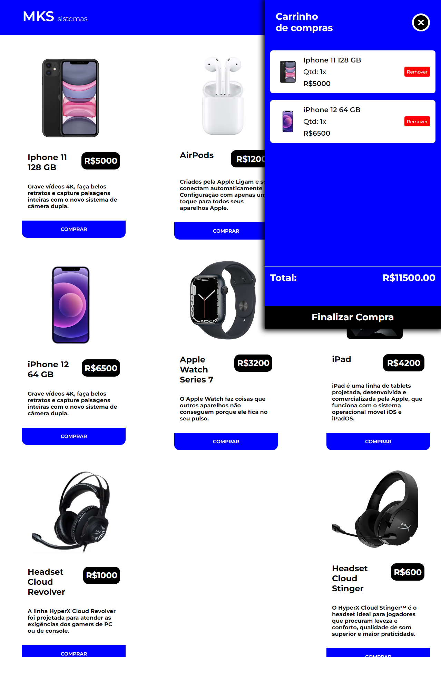

Click here to change the language:

 

# TripAdventure

The **MKS sistemas** project is a website layout focused on providing the experience of an online store, based on a GitHub challenge (https://github.com/star-soft/starsoft-frontend-challenge/tree/main). Developed in NextJS, the site features smooth and responsive navigation. With visually appealing icons from the API provided by the challenge and the React Icons library, the project aims to convey an immersive feel to an ecommerce prototype. Through this project, the goal is to inspire and practice studies on the technologies involved.

 

:computer: [Click here to access the application](https://trip-adventure.vercel.app/)

 

 

## Technologies

 

## Dependencies:

- next.js;
- react-dom;
- react-icons;

## Getting Started

This project can be used on your own machine after performing a PUSH of this repository.

### `npm install`

To download and update all project libraries and dependencies

### `npm run dev`

Runs the application in development mode.
Open [http://localhost:3000/](http://localhost:3000/) to view it in your browser.

The page will reload when you make changes.
You may also see any lint errors in the console.

## Contact

  
   
  
   

